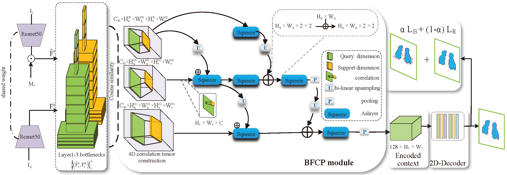

<<<<<<< HEAD
# BFC-BL: Few-Shot Classification and Segmentation combining Bi-directional Feature Correlation and Boundary constraint



##  Environmnet installation

Make sure to replace `YOURCONDADIR` in the installation path with your conda dir, e.g., `~/anaconda3`

Set up the following basic environment:

- [Ubuntu 18.04](https://ubuntu.com/download)或Windows 10（带有Anaconda/Miniconda）
- [Python 3.7](https://pytorch.org/)
- [CUDA 11.0](https://developer.nvidia.com/cuda-toolkit)

```
conda create -n bfc-bl python==3.7
conda activate bfc-bl
```

The required packages are as follows：

- [`pytorch`](https://pytorch.org/)==1.7.0
- [`torchvision`](https://pytorch.org/vision/stable/index.html)==0.8.1
- [`cudatoolkit`](https://developer.nvidia.com/cuda-toolkit)==11.0.3
- [`pytorch-lightning`](https://www.pytorchlightning.ai/)==1.3.8
- [`einops`](https://einops.rocks/pytorch-examples.html)==0.3.0

##  Datasets

- [PASCAL VOC 2012](http://host.robots.ox.ac.uk/pascal/VOC/voc2012/) and [SBD](http://home.bharathh.info/pubs/codes/SBD/download.html)

```
    YOUR_DATASET_DIR/
    ├── VOC2012/
    │   ├── Annotations/
    │   ├── JPEGImages/
    │   ├── ...
```

We follow the dataset protocol of [ASNet](https://github.com/dahyun-kang/ifsl), [HSNet](https://github.com/juhongm999/hsnet) and [PFENet](https://github.com/dvlab-research/PFENet).

## Related works

Our project refers to and heavily borrows some the codes from the following repos:

- [[PANet\]](https://github.com/kaixin96/PANet): Wang *et al*., Few-shot image semantic segmentation with prototype alignment, ICCV'19.
- [[PFENet\]](https://github.com/dvlab-research/PFENet): Tian *et al*., Prior guided feature enrichment network for few-shot segmentation, TPAMI'20.
- [[HSNet\]](https://github.com/juhongm999/hsnet): Min *et al*., Hypercorrelation squeeze for few-shot segmentation, ICCV'21.
- [[ASNet](https://github.com/dahyun-kang/ifsl)]: Kang *et al.*, Integrative Few-Shot Learning for Classification and Segmentation, CVPR'22
=======
# BFC-BL: Few-Shot Classification and Segmentation combining Bi-directional Feature Correlation and Boundary constraint


##  Environmnet installation

Make sure to replace `YOURCONDADIR` in the installation path with your conda dir, e.g., `~/anaconda3`

Set up the following basic environment:

- [Ubuntu 18.04](https://ubuntu.com/download)或Windows 10（带有Anaconda/Miniconda）
- [Python 3.7](https://pytorch.org/)
- [CUDA 11.0](https://developer.nvidia.com/cuda-toolkit)

```
conda create -n bfc-bl python==3.7
conda activate bfc-bl
```

The required packages are as follows：

- [`pytorch`](https://pytorch.org/)==1.7.0
- [`torchvision`](https://pytorch.org/vision/stable/index.html)==0.8.1
- [`cudatoolkit`](https://developer.nvidia.com/cuda-toolkit)==11.0.3
- [`pytorch-lightning`](https://www.pytorchlightning.ai/)==1.3.8
- [`einops`](https://einops.rocks/pytorch-examples.html)==0.3.0

##  Datasets

- [PASCAL VOC 2012](http://host.robots.ox.ac.uk/pascal/VOC/voc2012/) and [SBD](http://home.bharathh.info/pubs/codes/SBD/download.html)

```
    YOUR_DATASET_DIR/
    ├── VOC2012/
    │   ├── Annotations/
    │   ├── JPEGImages/
    │   ├── ...
```

We follow the dataset protocol of [ASNet](https://github.com/dahyun-kang/ifsl), [HSNet](https://github.com/juhongm999/hsnet) and [PFENet](https://github.com/dvlab-research/PFENet).

## Related works

Our project refers to and heavily borrows some the codes from the following repos:

- [[PANet\]](https://github.com/kaixin96/PANet): Wang *et al*., Few-shot image semantic segmentation with prototype alignment, ICCV'19.
- [[PFENet\]](https://github.com/dvlab-research/PFENet): Tian *et al*., Prior guided feature enrichment network for few-shot segmentation, TPAMI'20.
- [[HSNet\]](https://github.com/juhongm999/hsnet): Min *et al*., Hypercorrelation squeeze for few-shot segmentation, ICCV'21.
- [[ASNet](https://github.com/dahyun-kang/ifsl)]: Kang *et al.*, Integrative Few-Shot Learning for Classification and Segmentation, CVPR'22
>>>>>>> 2513283542674b3f629354b9cd49f8a535948419
